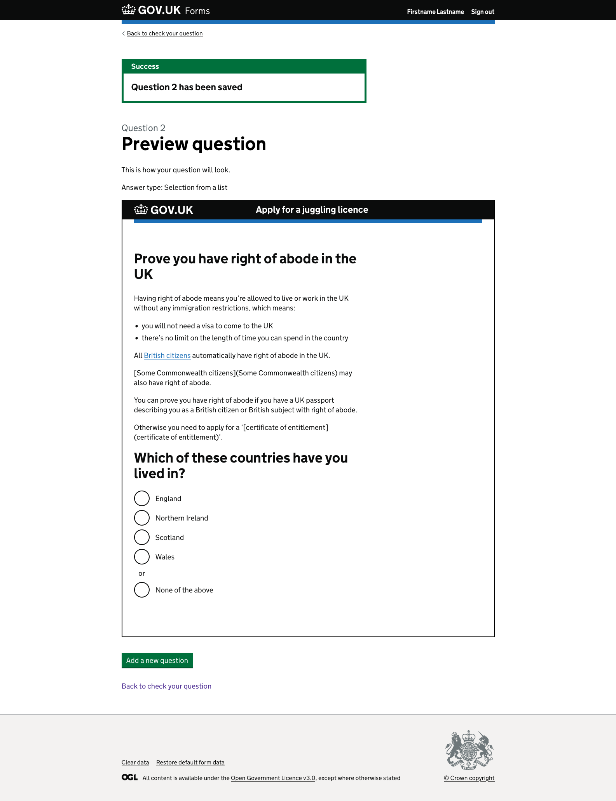

# Previewing a question v1

## Status

Date created: *2023-12-19*  

For testing  

___

## Contents

- [Status](#status)
- [Contents](#contents)
- [What](#what)
- [Key decisions](#key-decisions)
- [Design](#design)
- [Notes](#notes)
- [Research focus](#research-focus)

___

 

## What

### As-is

- Form creators need to add their questions, go back to the list of questions they have added to their form and then click into the preview journey previewing every question within the form to see a single question and how it looks, and potentially will work. 

### To-be

- Form creators can add their question and get a quick preview with their content as it would appear to the form fillers. They can then continue adding questions to their form without the need to navigate back and forth.  

## Key decisions

We want to: 

- make the smallest quick win change we think will benefit form creators  
- make sure the preview works for any assistive technology, something we had found issues with previously
- make the preview a conscious choice for form creators so as they learn the product they can skip over unnecessary screens  

 

## Design  

### Initial Mural design  

  
*Preview question page giving example of a companies name question.*  

The screen shows some explanatory text:  

> This is how the question will look.
>
> For this answer type, people can enter text into the box of up to x characters.

There is some text explaining that the preview does not actually allow interactions, and if the user wants to test the validation and errors they can preview the full form:  

> You cannot ente text into this preview to try it out - you can do this in the preview of the whole form.  

Below is a box with the GOV.UK header including the form’s name.  

Within the box it also shows the question text the form creator has added, “What’s your company called?” with a single line input text box.  

Below the preview box, there is a green “Create next question” button followed by ‘or’ and a link “Edit this question” - used to take the form creator back to edit the current question.  

### Default answer type  

#### Check your question page - example with simple question   

  
*Check your question page showing a summary of the question added.*

The page shows an section titled “Answer settings”. It includes a definition list summarising the answer type and specific settings for this answer type. Each row had a change link for form creators make changes if they need to.  

Next is a “Your question” section. Summarising the optional content a form creator has added including the “question text”, “hint text” which is optional and an answer if they needed to add guidance or make the question optional. Each row has a change link.  

There are two call to action buttons. “Save question” as the primary green call to action and “Save and preview” grey button as a secondary call to action. Below is a link “Back to edit question”, the last page the user was on - replicating the back link from the top of the page.  

#### Preview question page - example with simple question   

  
*caption*  

### Complex answer type  

#### Check your question page - example with complex question with guidance   

   
*caption*  

#### Preview question page - example with complex question with guidance   

  
*caption*  

 

## Notes

- 

___

 

## Research focus

### Things we plan to focus on in testing:
- 

 

___

 

[Back to the top](#previewing-a-question-v1)
