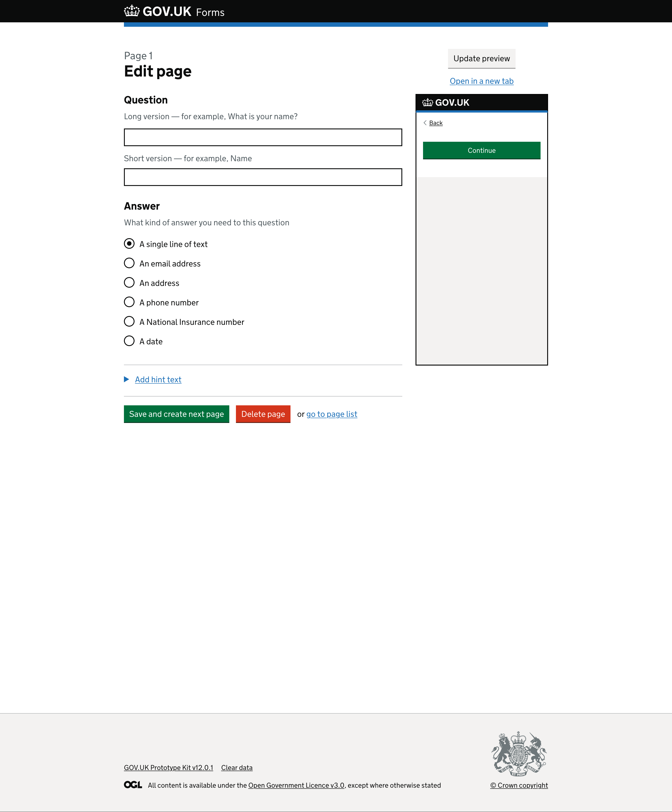
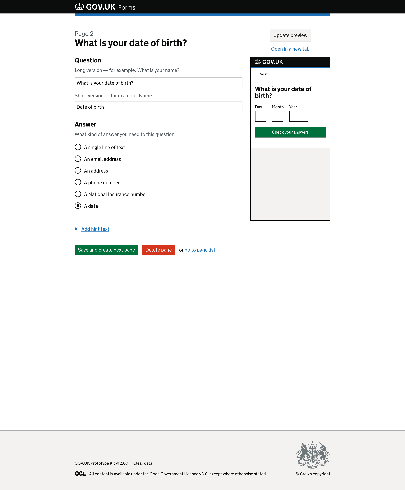
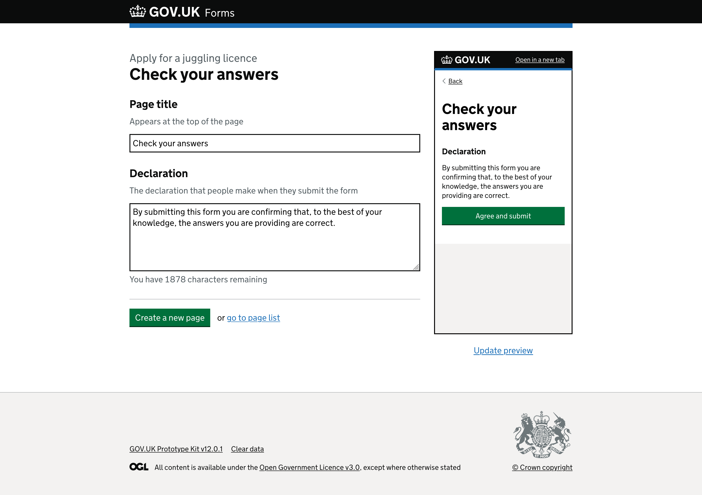
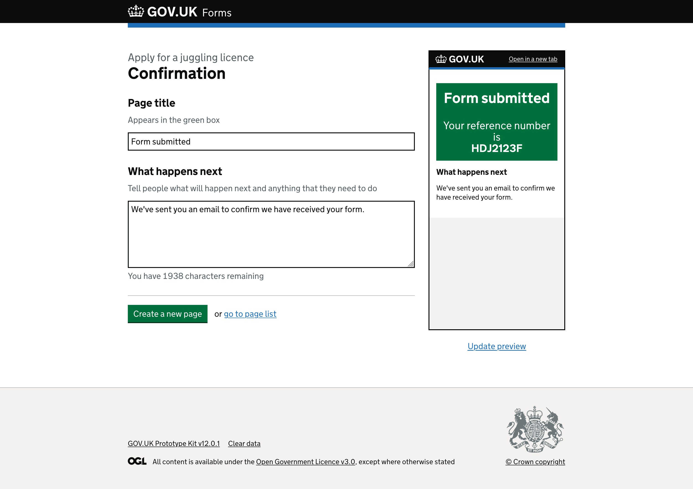
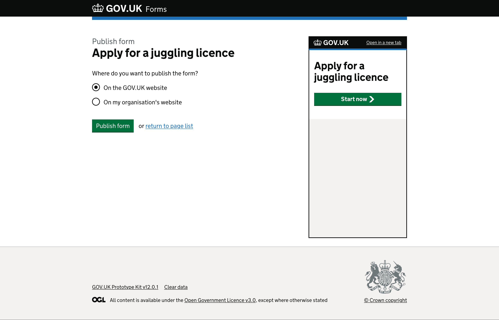
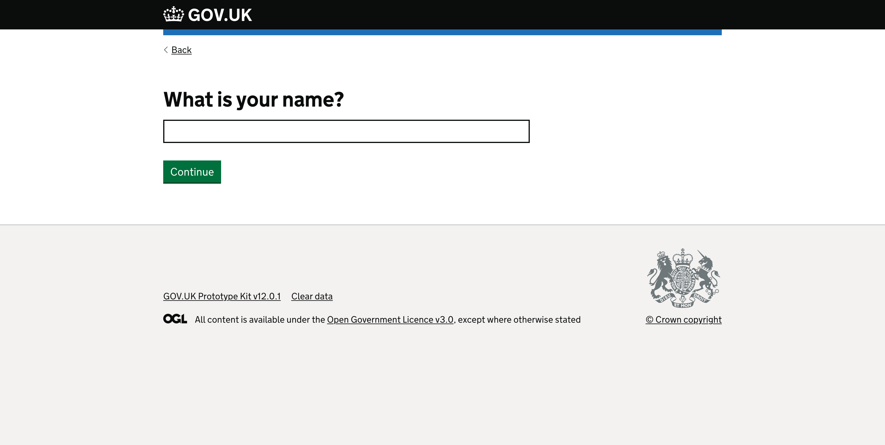
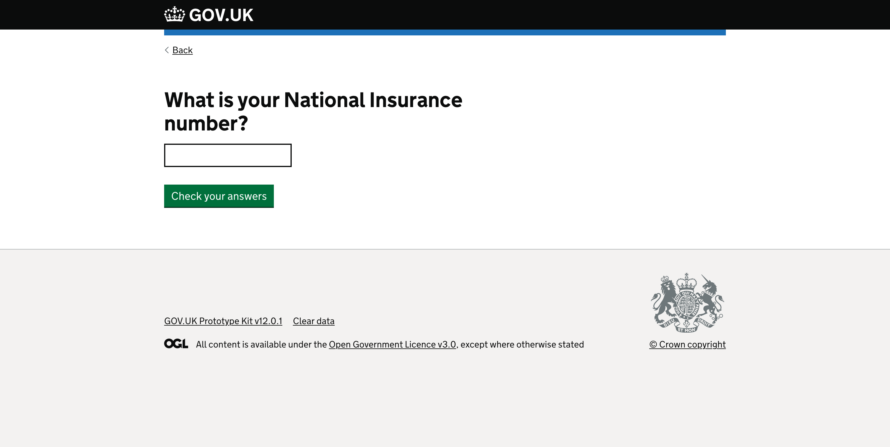

# Prototype version 1

Dates tested: *2022-05-03 to 2022-05-04*

## Status

Superceeded by [version 2](../prototype-version-2)

___

## Contents

- [Context](#context)
- [Admin interface screenshots](#admin-interface-screenshots)
- [Form runner screenshots](#form-runner-screenshots)
- [What we learned](#what-we-learned)
- [Opportunites](#opportunities)

___

 

## Context

> **Sprint 2**  
> For this round of testing we want to get a baseline with our first private beta partners at the Insolvency Service

We plan to test the full creation of a sample form as if the user has already logged into the GOV.UK Forms platform and is re-creating one of their department's existing document-based forms.

 
 

## Admin interface screenshots

Below are the screens a form creator will see when making or editing their forms.

 

### GOV.UK Forms landing page

*Page with “GOV.UK Forms” heading and green “Create a form” start button.*

 

#### **Analysis**

- This page acted as expected for all users, with some going into further detail about what they’d also see here in future - such as list of forms they had created, both in progress or live 
    > “Expect GDS to be good at these things - this looks like I expected” - P1

#### **User comments**

- P1: “link to help might possibly be here, incase you've never done it before”
- P1: “not sure if there's training here too?”

---

 

### Name your form page

*Page with “What is the name of your form?” question heading.*

There is hint text that says, “Use a name that describes what the form will help people to do. For example, ‘Apply for a licence’.” above a text input.

Below the text input is a green “Save and continue” button.

 

#### **Analysis**

- Unclear what GOV.UK Forms is
- Unclear what the form name is used for
- Unclear where the form name would appear 

#### **Team comments**

- would hint text help and state this is a draft name whilst you’re designing your form so you can find it in a list?  
- drop downs and auto populating is interesting but we’d be worried about taking away the nudge to improve them and make their content more appropriate  
- we need a name at least so they can find the form again  

#### **Ideas**

- change ‘save and continue’ to ‘save and add a question’
- make naming the form to be mandatory 
- add ‘you can change this later’

#### **Actions**

- [X] change the hint text for future testing
- [X] add an error page, to make the name input mandatory

---

 

### Form overview page

*Page with “Form” caption above the heading “Apply for a juggling licence”.*

There is a paragraph of text, “2 page draft form.” above a green “Add a question” button followed by a link to “Preview form (opens in new tab)”.

Below the link is a summary list component of the standard generated pages, “Check your answers” and “Confirmation”. To the right of each of these rows is an “Edit” link.

*Page with “Form” caption above the heading “Apply for a juggling licence” with newly added questions listed in a summary list component.*

The paragraph of text has now updated to “5 page draft form - Publish.” with “Publish” as a link.  
The green “Add a question” button followed by a link to “Preview form (opens in new tab)” still appear below the paragraph.

Below the link there are now three new pages that have been added by the form creator and appear at the top of the summary list. In three new rows, the short version of the name given to a question appear on the left.  

On the right are grey buttons for moving the page ‘Up’ or ‘Down’ reordering them in the form journey.   
Depending on where they are in the list, the buttons vary. The first row - and therefore the first page in the form - only has a ‘Down’ button, while the second row has both an ‘Up’ and ‘Down’ button, and the final row - and final question page in the form - only has an ‘Up’ button.

Each new row also has a relevant “Edit” link to make changes to the corresponding page.

 

#### **Analysis**

- Concerns about reordering many pages
- Users could reorder pages, but took an extra moment to check if it worked
  > “Did that actually do anything... yeah it's working” - P1
- Users perceived the page list in different ways due to the additional generated pages - another pointed out that it could be difficult for them with the amount of information (numbering questions was suggested to help them)

#### **User comments**

-  P3: “What if it was 50 questions in a form that you have added at the bottom and you want to take it to number 8 it would be cumbersome.” ... “instead use an arrow or a dragging option would work for longer forms.”

#### **Team comments**

- Agreed. I think this is an IA thing, could potentially be solved with a task list / Check your answers type approach
Chunk the page up into digestible sections
- I think people expected this screen to be a preview of the form questions. Adding more detail to each entry might help explain what things are
- Having a task list approach would mean we could show the next step/stage as they progress through the form creation process
- That task list idea may help to provide the structure they'd need to know and then supported by good design and maybe training materials.
- P2 Expected a ‘save and finish’ button - is this something we need to consider?

#### **Ideas**

- explore task list / Check your answers type approach to break up the page into sections
    - “Your pages” > “Our pages” (CYA/Confirmation) > “Next steps” (get the form live)
- Can we add numbers down the side? 
- Can we make it so the list is more delineated between questions - thinker line? 
- How can we make it so that users can shift up and down by section or by more than one question at a time? E.g. Jump up button
- Consider more descriptive labels for 'up' and 'down'? 'Move up' and 'move down' might be quite cumbersome though

#### **Actions**

- [X] hide everything except “Add a question” button, until at least one question has been added
- [X] remove content “X page draft form.”
- [X] improve chunking of generated versus created questions/pages

---

 

### Edit page 1

*Page with “Page 1” caption above heading “Edit page”.*

A secondary heading, “Question”, comes directly before the hint text “Long version - for example, What is your name?” and a text input.  
A second hint text of “Short version - for example, Name” comes next before a second text input.

Below is another secondary heading, “Answer”, with the hint text “What kind of answer you need to this question”. There are then radio buttons that determine the input type required:

- A single line of text
- An email address
- An address
- A phone number
- A National Insurance number
- A date

There is a detail component, blue link with an arrow before the text, “Add hint text”, that is currently collapsed.

The page ends with a green “Save and create next page” button; a red “Delete page” button; the word ‘or’; and finally a “go to page list” link.

<!-- describe side preview pane -->
On the right side of the screen there is a grey “Update preview” button above an “Open in a new tab” link.

Below the link is a smaller version of an empty GOV.UK service page within an iframe, mimicking a mobile screen. It shows the GOV.UK logo on a black header. Within the body of the page is a ‘Back’ link and below this is a green ‘Continue’ button.

<!-- describe expanded hint text -->
*Page with “Page 1” caption above heading “Edit page” with detail component expanded.*

The detail component, “Add hint text”, is now expanded revealing the hint text “A short hint to help people answer the question” before a text input.

 

#### **Analysis**

##### **Long and short question text**
- Not sure why long and short questions are needed  
  > P2: Left short version blank for most questions.  

  > P3: The long versions and short version, was an unexpected question. Initial thinking is to put the short version.  

##### **Answer types**
- Felt answer types were missing or limited
- NINo format is a possible answer type missing
- Answer type didn’t match mental model for asking a Name  
  > “you might want Name as a type here too. If you wanted first name and last name separately. At the moment you’d have to do two separate form fields.” - P1  

##### **Previewing**
- Wants an option to save and preview the previous questions
- The purpose of the small preview pane is not obvious
  - Preview pane is not useful for the preview page 

##### **Other**
- Associated 'hint text' to adding information that goes on the start page
- Felt ‘add a page’ button would allow creator to add different elements other than a question to a page eg. hint text 

#### **Team comments**

-   Previously add a question was add a page. Makes sense for now as we are adding one question to 
-   What answer types need some extra explanation?

#### **Ideas**

- One user suggested: having an “add a question and add a page button”
    - Because not only are you adding questions you are adding other different kinds of things like guidance 
    - They would prefer an extra option to add a different bit and type of content

#### **Actions**

- [X] change ‘page list’ in the ‘go to...’ link to ‘form overview’  
- [X] change any reference to ‘page’ to ‘question’  
- [X] make long version the main option and make short version optional
- [X] add context for both ‘long’ and ‘short version’
- [X] move hint text up  
- [X] change the buttons on the left hand side ‘update preview’ to ‘save changes’
- [X] add a ‘back’ button

---

 

### Edit page 2 - saved page

*Page with “Page 2” caption above heading “What is your date of birth?”.*

The first text input contains the text that appears as the pages heading, “What is your date of birth?”.

The second text input with hint text ‘short version’ has the text “Date of birth” in the text input.  

‘A date’ radio has been selected.

<!-- describe side preview pane -->
On the right side of the screen the iframe has updated to show the question text “What is your date of birth?” and displays the date component underneath with separate inputs labelled ‘Day’, ‘Month’ and ‘Year’.

 

### Edit check your answers

*Page with “Apply for a juggling licence” caption above the heading “Check your answers”.*

There is a secondary heading label, “Page title”, with hint text “Appears at the top of the page”. Below is a prefilled text input containing, “Check your answers”, also shown in the preview iframe on the right.

There is another secondary heading label, “Declaration”, with hint text “The declaration that people make when they submit the form”. Below this is an editable text area containing a provided example of what the form filler needs to agree to, “By submitting this form you are confirming that, to the best of your knowledge, the answers you are providing are correct.”  
Under the text area is a character counter, “You have 1878 characters remaining”, giving form creators an idea of how much they have left of a 2,000 character limit.

At the end of the page is a green “Create a new page” button followed by the word ‘or’ and a “go to page list” link.

<!-- describe side preview pane -->
On the right side of the screen the iframe includes the title “Check your answers” and displays the secondary heading, “Declaration”, above the text area content provided on the left.

There is a button styled like a link, “Update preview”, centered to the aside underneath the iframe.

 

#### **Analysis**

- Users seemed confused by this screen, and tended to switch hats between creator and filler
  > P3: Thought check your answers meant preview what you have done.  

  > P3 suggested: Instead call it 'add your declaration page'  
  > Not sure if every form needs a declaration?  

  > “For the Check your answers page, I think this would be 
 a way to edit wording or order the questions.” - P1  

#### **Actions**

- [X] make preview consistent with edit page

---

 

### Edit confirmation page

*Page with “Apply for a juggling licence” caption above the heading “Confirmation”.*

There is a secondary heading label, “Page title”, with the hint text “Appears in the green box”. Under this is an editable text input containing a provided name, “Form submitted”, also shown in the preview on the right.

There is another secondary heading label, “What happens next”, with hint text “Tell people what will happen next and anything that they need to do”. Below this is an editable text area containing a provided example of what the form filler should expect, “We’ve sent you an email to confirm we have received your form.”  
Below the text area is a character counter, “You have 1938 characters remaining”, giving form creators an idea of how much they have left of a 2,000 character limit.

At the end of the page is a green “Create a new page” button followed by the word ‘or’ and then a “go to page list” link.

<!-- describe side preview pane -->
On the right side of the screen the iframe includes the title “Form submitted” above text “Your reference number is HDJ2123F” in a green box. There is also a secondary heading, “What happens next”, above the text area content provided on the left.

There is a button styled like a link, “Update preview”, centered to the aside underneath the iframe.

 

#### **Analysis**

- Users seemed confused by this screen, and tended to switch hats between creator and filler
  > P2 initially thought the ‘confirmation’ was aimed at them as the form creator, rather than being a page aimed at the end user.  

#### **User comments**

- P1: Who gets the reference numbers? Is that part of the email?
- P1: Where is it going to ask me where I as the creator put an email in, how I publish it. I would expect a ‘finalise this form’ or something like that at the bottom. ‘Finalise and publish’ or something like that. 

#### **Actions**

- [X] make preview consistent with edit page

---

 

### Publish a form

*Page with “Publish form” caption above the heading “Apply for a juggling licence”.*

There is a question, “Where do you want to publish the form?” with two radio options below, “On the GOV.UK website” and “On my organisation’s website”.

There is a green “Publish form” button, the word ‘or’, and then a link to “return to page list”.

<!-- describe side preview pane -->
On the right side of the screen the iframe includes the title “Apply for a juggling licence” above a green “Start now” button to simulate the journey from the start page.

 

#### **Analysis**

- Users wanted some confirmation and playback of the link to their form
  > P1: After clicking 'publish' said, “I would expect it to say ‘it’s been published’, here’s a link to it on the live site. Enjoy your day.”  
- One expected it to go to some kind of 2i process, even after ‘publishing’ the form
  > P2: thats what happens for gov.uk publishing
- One user did not even see the link to publish their form

#### **User comments**

- P1: “What does publishing ‘on my organisation’s website’ mean?”

#### **Team comments**

- We need to make it clear what publishing on the organisations means. And make it clear the next steps after  
- Could probably get part of the publish journey hooked up in prototype for next round...

---

 
 

## Form runner screenshots

Below are the screens the form filler (the end user) would see as they complete the form.

 

### Preview start page

*Page with “Apply for a juggling licence” heading and a green “Start now” button containing a white arrow.*

 

### Preview question 1

*Page with “What is your name?” question as a label for a text input. There is a green “Continue” button at the bottom.*

This page is an example of the first (and all following) question pages that a form creator has added to their form.  

The basic structure includes a “Back” link which should take the form filler to the previous page, mimicking the browser back button - in this instance it would return the user to the start page.

When the form filler clicks the “Continue” button the product should validate that an input has been given (field is not empty or radio is selected for example) before continuing through to the next question in sequence.

 

### Preview final question

*Page with “What is your National Insurance number?” question as a label for a text input. There is a green “Check your answers” button at the bottom.*

This page is an example of the last question in a form sequence. The difference being a green “Check your answers” button in place of the usual “Continue”.

 

### Preview check your answers (summary page)

*Page with “Check your answers” heading followed by a summary list component.*

The summary list component lists rows of the “Short version” of the questions the form creator has added with a space to the right where the form fillers answer would appear. Finally there is a “Change” link for the form filler to correct or change any answer they feel is incorrect.

Below is a secondary heading, “Declaration”, before the text “By submitting this form you are confirming that, to the best of your knowledge, the answers you are providing are correct.” This is an example declaration for the form filler to agree to, by clicking the green “Agree and submit” button. The text of the declaration is editable by the form creator within the admin side of the builder, meaning it can be customised as to the needs of the different forms or department.

 

### Preview form submitted (confirmation page)

*Page with “Form submitted” heading followed by “Your reference number is HDJ2123F” in a green box.*

This page includes a secondary heading “What happens next” followed by the content “We’ve sent you an email to confirm we have received your form.” This text is editable by the form creator within the admin side of the builder, meaning it can be customised as to the needs of the different forms or department and should match their internal service level agreements (SLAs).

 

___

 

## What we learned

Overall users found the experience of creating a form “easy”, but there were several areas that caused confusion. This was due to use of unknown terminology or lack of explanation of what was being shown or asked for.  

There was some worry about losing progress if they were to navigate around the system, whether to preview or if they felt that they were ‘finished’. Showing a need for some kind of feedback when tasks are completed.  

To see the write up go to [Research: Basic form building](../../research/2022-05-03_Basic_Form_Building.md).

 

## Opportunities 

### Ideas

- explore task list idea to help form creators complete their forms, step by step

### Next steps

- update the prototype for the next round of testing

 

[Back to the top](#prototype-version-1)
