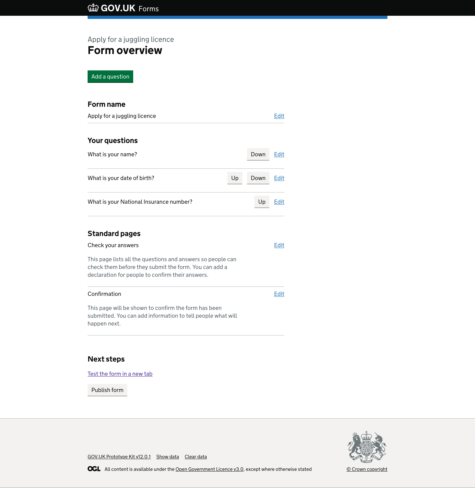

# Form overview page

## Context

For this round of testing we removed clutter from teh screen, only making certain elements appear when the user had added questions to their form and returned to the ‘form overview’ screen. We introduced sections to help the user identify what they were seeing - questions they had added versus pages added by the tool and what their next steps should be. We wanted to understand if this made sense to users and if it would be helpful to offer more handholding throughout the creation journey.  

As part of the testing we asked users to create a form, and then explored returning to edit an existing form, including the task of changing the name of a form, based on feedback from a colleague.  

## What we tested last time

### User first lands on the ‘form overview’ page without any questions

*Page with “Form” caption above the heading “Apply for a juggling licence”.*

There is a paragraph of text, “2 page draft form.” above a green “Add a question” button followed by a link to “Preview form (opens in new tab)”.

Below the link is a summary list component of the standard generated pages, “Check your answers” and “Confirmation”. To the right of each of these rows is an “Edit” link.  

### User lands on the ‘form overview’ page after adding some questions

*Page with “Form” caption above the heading “Apply for a juggling licence” with newly added questions listed in a summary list component.*

The paragraph of text has now updated to “5 page draft form - Publish.” with “Publish” as a link.  
The green “Add a question” button followed by a link to “Preview form (opens in new tab)” still appear below the paragraph.

Below the link there are now three new pages that have been added by the form creator and appear at the top of the summary list. In three new rows, the short version of the name given to a question appear on the left.  

On the right are grey buttons for moving the page ‘Up’ or ‘Down’ reordering them in the form journey.   
Depending on where they are in the list, the buttons vary. The first row - and therefore the first page in the form - only has a ‘Down’ button, while the second row has both an ‘Up’ and ‘Down’ button, and the final row - and final question page in the form - only has an ‘Up’ button.

Each new row also has a relevant “Edit” link to make changes to the corresponding page.

### What we saw

When testing...

## What we changed and why

We removed unnecessary content from the screen, such as reference to number of pages in the draft and the summary list of standard generated pages - check your answers and confirmation page - on first time the user lands on the screen, or where there are no questions added to the form yet. We wanted to reduce confusion and test if we should simplify the page going forward.  

*Page with “Apply for a juggling licence” caption above the heading that says “Form overview”.*

There is a green “Add a question” button.

*Page with “Apply for a juggling licence” caption above the heading that says “Form overview” with newly added questions listed in a summary list component.*

There is a green “Add a question” button.

‘Form name’ ... 

‘Your questions’ ... summary list, ‘Down’, ‘Up’ and ‘Edit’ actions

‘Standard pages’ section ... 
‘check your answers’ with hint text, ‘Edit’ link on the right
‘confirmation’ with hint text, ‘Edit’ link on the right

‘Next steps’ section ... link to “Test the form in a new tab” above a grey ‘Publish form’ button.  

### Feedback from testing this version 

- 
  > 
