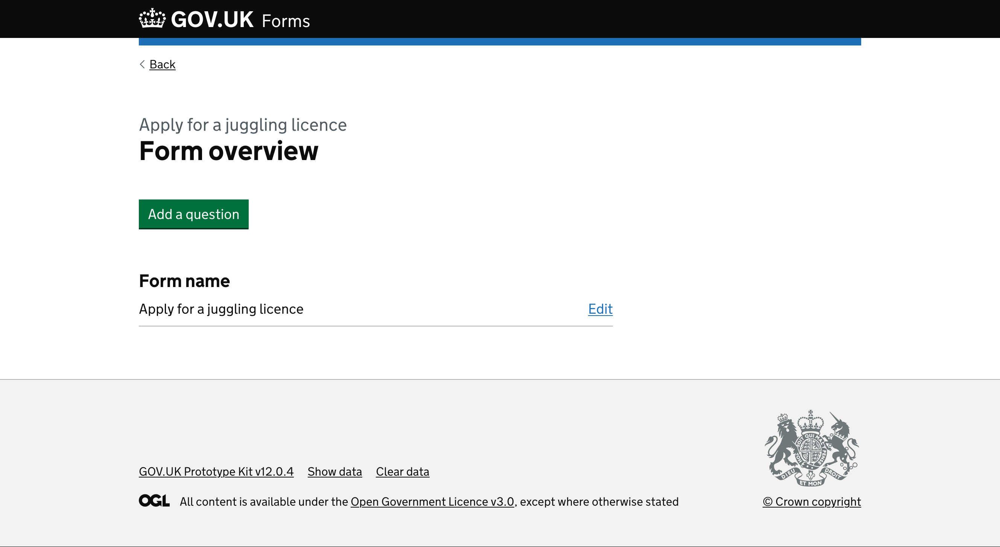

# Form overview page

## Context

For this round we tested with users with access needs. We wanted to get a better understanding of how the tool performed for these users.  
We did some minor changes based on findings from the previous round in order to make sure we got new insights.  

## What we tested  

In this version we:  

- made the ‘form name’ section appear the first time the user landed on the screen, no longer needing to add questions before it appear. This meant they could quickly see and edit any issues straight away
- added ‘move’ to the buttons to give better context of what the buttons did when the user had added some questions, this was based on some confusion from the previous round and we thought it would make the buttons purpose more obvious
- added some visually hidden text to ‘edit’ links and ‘move down/up’ buttons to help users with screen readers get a better idea of which question they were editing  

### User first lands on the ‘form overview’ page without any questions  

*Page with “Apply for a juggling licence” caption above the heading “Form overview”.*

The page has a green “Add a question” button.   

Beneath is a section titled “Form name” with a summary list showing the name of the form, “Apply for a juggling licence”, and an ‘edit’ link to change this if needed.   

### User lands on the ‘form overview’ page after adding some questions  

*Page with “Apply for a juggling licence” caption above the heading that says “Form overview” with newly added questions listed in a summary list component.*

There is a green “Add a question” button.  

Below this is a section titled ‘Form name’ with a summary list showing the form name as the user had entered it with an ‘Edit’ link to the right of the row.  

The next section is titled ‘Your questions’. There is a summary list showing the questions the user has added; “What is your name?”; “What is your date of birth?”; and “What is your National Insurance number?”. In each row alongside the questions are actions the user can take. There is a ‘Move down’ button for the first and second question. A ‘Move up’ button for the second and last question. Each row ends with an ‘Edit’ link.   

The next section ‘Standard pages’ shows the pages that the platform automatically adds for each form. These include:  

- ‘Check your answers’ which has hint text of “This page lists all the questions and answers so people can check before they submit the form. You can add a declaration for people to confirm their answers.” under the name. On the right side of the row is an ‘Edit’ link.  
- ‘Confirmation’ with hint text “This page will be shown to confirm the form has been submitted. You can add information to tell people what will happen next.” There is an ‘Edit’ link on the right.  

The final section is titled ‘Next steps’. There is a link to “Test the form in a new tab” above a grey ‘Publish form’ button.

### What we saw

- Participant 1 wasn’t sure what the ‘up’ and ‘down’ buttons were for. When they tried them it still wasn’t clear what they did
  > “I’m not quite sure on what up and down button are for really”  
- Participant 1 also suggested that numbering the questions would have helped them identify if the question ‘move’ had taken place  

After the first session, we updated the button content to include “Move” before the ‘up’ or ‘down’ action.  

- The next 5 participants saw the new version of ‘move’ buttons. None seemed to have any issues with understanding what their purpose was now. However, a couple of users were unsure if the ‘move’ action had happened and struggled to check
  > P3: “There is no save changes option here so I wonder if these are changed”  
