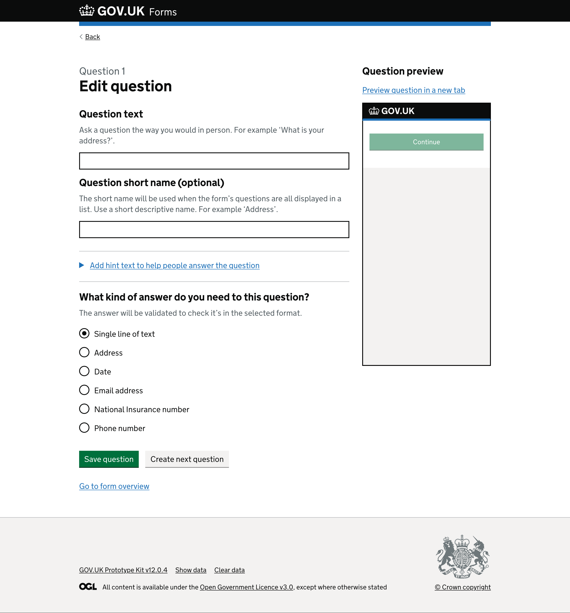

# Edit question page

## Context

> Give a brief overview of
> - what we wanted to test for example, user needs or design changes
> - what tasks we gave to users

## What we tested last time

*Page with “Question 1” caption above a heading “Edit question”.*

A secondary heading, “Question text”, comes directly before the hint text “Ask a question the way you would in person. For example ‘What is your address?’” and then a text input.

A second secondary heading, “Question short name (optional)”, followed by hint text “The short name will be used when the form’s questions are all displayed in a list. Use a short descriptive name. For example ‘Address’.” and then a text input.

Below these is a detail component, blue link with an arrow before the text, “Add hint text to help people answer the question” that is closed.

Next is a secondary heading, “What kind of answer do you need to this question?”, which has the hint text “The answer will be validated to check it’s in the selected format.” Below are radio buttons that determine the input type required:

- Single line of text, selected
- Address
- Date
- Email address
- National Insurance number
- Phone number

The page ends with a green “Save question” button, next to a grey “Create next question” button. Below the two buttons is a “Go to form overview” link.

<!-- describe side preview pane -->
On the right side of the screen there is a secondary heading, “Question preview” with a link to “Preview question in a new tab”.

Below the link is a smaller version of an empty GOV.UK service page within an iframe, to mimic a mobile screen. It shows the GOV.UK logo on a black header. Within the body of the page is a disabled green ‘Continue’ button.

### What we saw

> Give a synopsis of the key findings from the round of research we tested this version.  
> Include examples of found needs, pain points or quotes to help explain the findings. These do not have to be too detailed, as this should be covered in the research findings packs/decks - which can be linked to from here.

## What we changed and why

*Page with “Question 1” caption above a heading “Edit question”.*

A secondary heading, “Question text”, comes directly before the hint text “Ask a question the way you would in person. For example ‘What is your address?’” and then a text input.

A second secondary heading, “Hint text (optional)”, followed by hint text “You can use hint text if you need to explain the format the answer should be in, or where to find the information you’ve asked for.” and then a text input.

Next is a secondary heading, “What kind of answer do you need to this question?”, which has the hint text “The answer will be validated to check it’s in the selected format.” Below are radio buttons that determine the input type required:

- Single line of text (selected)
- Address
- Date
- Email address
- National Insurance number
- Phone number

The page ends with a green “Save and add next question” button next to a grey “Save and preview question” button.  
Below is a blue link “Go to form overview”.

<!-- describe side preview pane -->
On the right side of the screen there is a secondary heading “Question preview” above a link to “Preview question in a new tab”.

Below the link is a smaller version of an empty GOV.UK service page within an iframe. It shows the GOV.UK logo on a black header. Within the body of the page is a disabled green ‘Continue’ button.

> What changes did we decide to make in order to improve the user experience, and why do we think this will help.  
> List any changes and the hypothesis behind them, or the problem they intend to solve.
