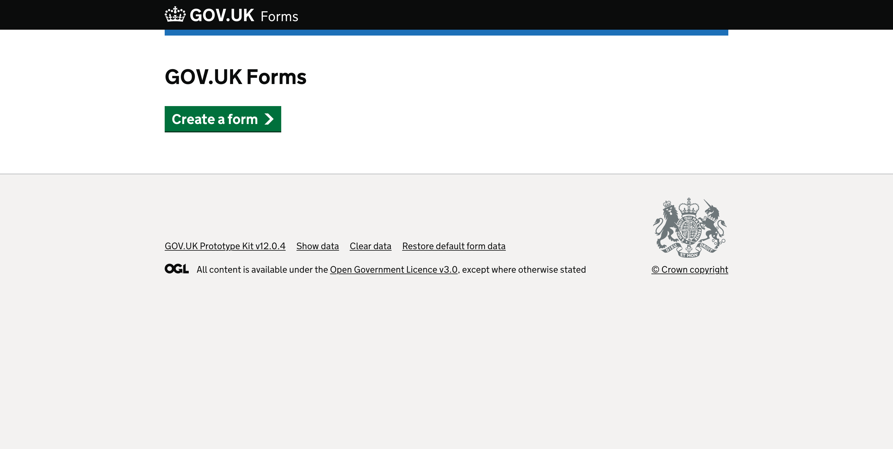
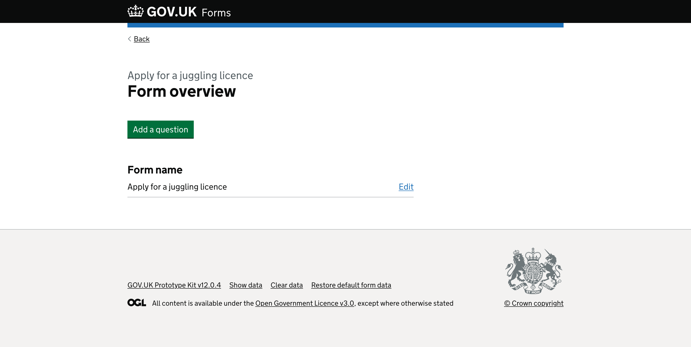
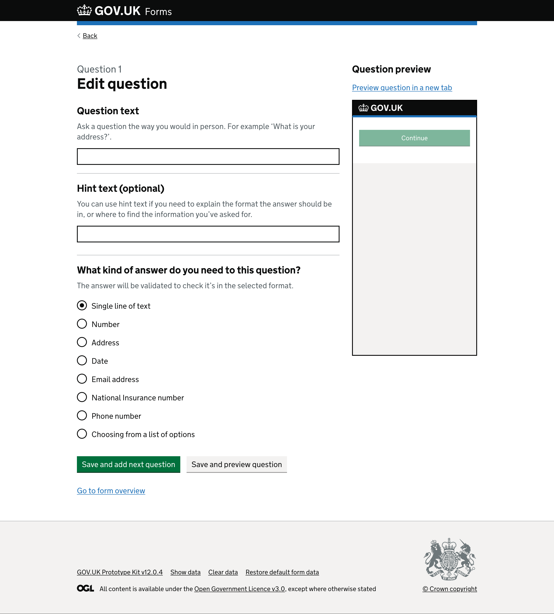
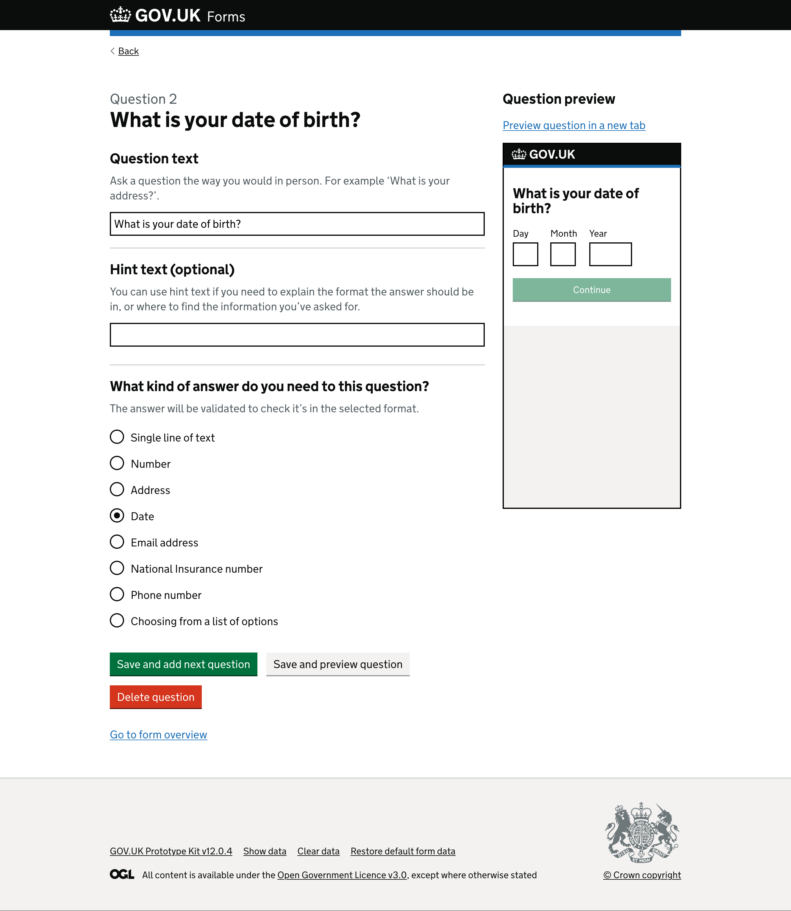
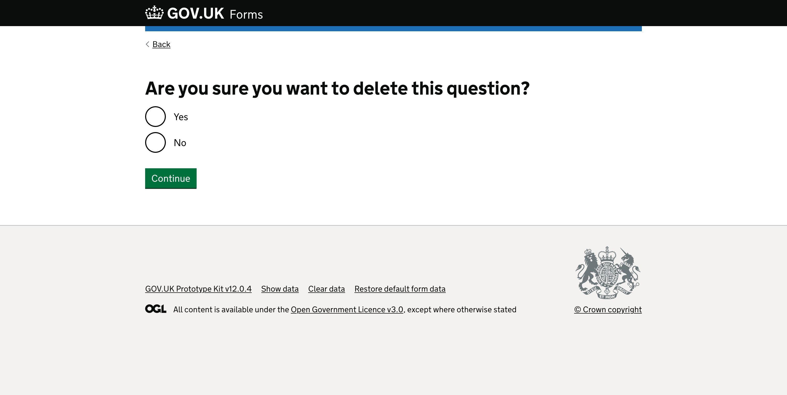
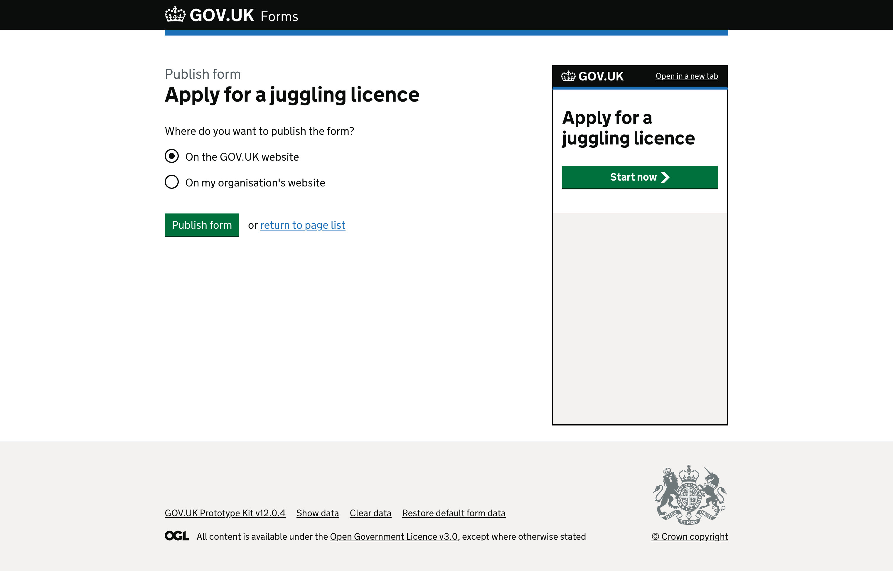
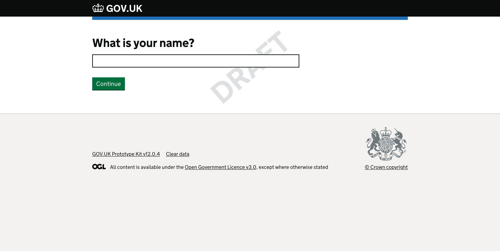
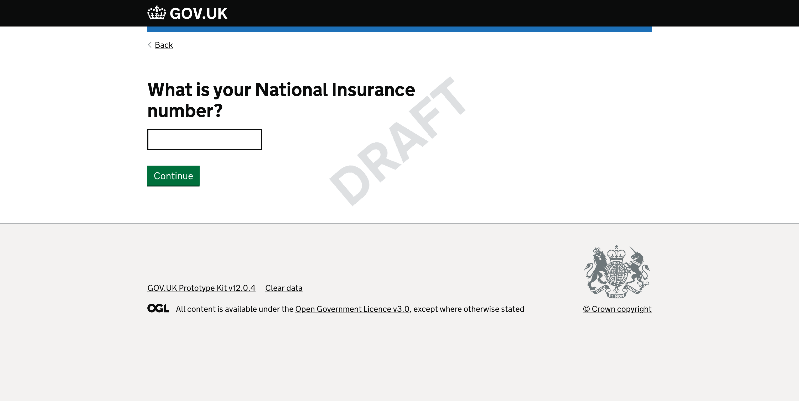
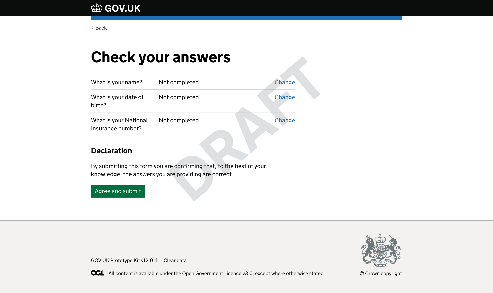
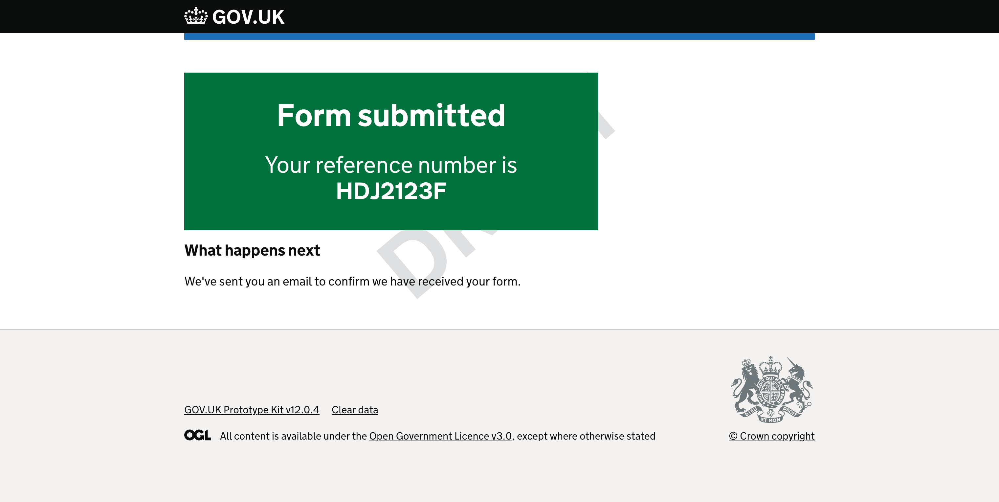

# Prototype version 5

Dates tested: 

## Status

Superceeded by [version 6](../prototype-version-6)

___

## Contents

- [Context](#context)
- [Admin interface screenshots](#admin-interface-screenshots)
- [Form runner screenshots](#form-runner-screenshots)
- [What we learned](#what-we-learned)
- [Opportunites](#opportunities)

___

 

## Context

> **Sprint X**
> In this sprint we want to test

 
 

## Admin interface screenshots

Below are the screens a form creator will see when making or editing their forms.

 

### GOV.UK Forms landing page

*Page with “GOV.UK Forms” heading and green “Create a form” start button.*

 

### Name your form page

*Page with “What is the name of your form?” question heading.*

There is hint text that says, “The form name will be shown at the top of each page of the form. Use a name that describes what the form will help people to do. For example, ‘Apply for a juggling licence’.” above a text input.

Below the text input is a green “Save and continue” button.

 

### Form overview page

*Page with “Apply for a juggling licence” caption above the heading that says “Form overview”.*

There is a green “Add a question” button.

Below the button is a secondary heading “Form name”. The form name appears below in a summary list component, with “Apply for a juggling licence” on the left with an “Edit” link on the right.

 

### Edit question 1

*Page with “Question 1” caption above a heading “Edit question”.*

A secondary heading, “Question text”, comes directly before the hint text “Ask a question the way you would in person. For example ‘What is your address?’.” and then a text input.

A second secondary heading, “Hint text (optional)”, followed by hint text “You can use hint text if you need to explain the format the answer should be in, or where to find the information you’ve asked for.” and then a text input.

Next is a secondary heading, “What kind of answer do you need to this question?”, which has the hint text “The answer will be validated to check it’s in the selected format.” Below are radio buttons that determine the input type required:

- Single line of text (selected)
- Address
- Date
- Email address
- National Insurance number
- Phone number

The page ends with a green “Save and add next question” button next to a grey “Save and preview question” button.  
Below is a blue link “Go to form overview”.

<!-- describe side preview pane -->
On the right side of the screen there is a secondary heading “Question preview” above a link to “Preview question in a new tab”.

Below the link is a smaller version of an empty GOV.UK service page within an iframe. It shows the GOV.UK logo on a black header. Within the body of the page is a disabled green ‘Continue’ button.

 

### Edit question 2 - saved question

*Page with “Question 2” caption above a heading “What is your date of birth?”.*

The first text input contains the text that appears as the pages heading, “What is your date of birth?”.

The second text input with the secondary heading label “Hint text (optional)” has the text “Date of birth” in the text input.  

The ‘Date’ radio is now selected.

<!-- describe side preview pane -->
On the right side of the screen the iframe has now updated to include the question text “What is your date of birth?” and displays the date component underneath with inputs for ‘Day’, ‘Month’ and ‘Year’. The green “Continue” button is still disabled.

 

### Delete a question

*Page with “Are you sure you want to delete this question?” as the heading.*

There are two radio options, “Yes” and “No”. Below is a green “Continue” button.

 

### Edit check your answers

*Page with “Check your answers” caption above the heading “Check your answers”.*

There is a secondary heading label, “Page title”, with the hint text “Appears at the top of the page”. Under this is an editable text input containing a provided name, “Check your answers”, also shown in the preview on the right.

There is another secondary heading label, “Declaration”, with hint text “The declaration that people make when they submit the form”. Below this is an editable text area containing a provided example of what the form filler needs to agree to, “By submitting this form you are confirming that, to the best of your knowledge, the answers you are providing are correct.”  
Below the text area is a character counter, “You have 1878 characters remaining”, giving form creators an idea of how much they have left of a 2,000 character limit.

At the end of the page is a green “Save changes” button above a “Go to form overview” link.

<!-- describe side preview pane -->
On the right side of the screen there is a secondary heading, “Page preview” with a link to “Preview page in a new tab”.

The iframe includes the title “Check your answers” and displays the secondary heading, “Declaration”, above the text input content provided on the left, “By submitting this form you are confirming that, to the best of your knowledge, the answers you are providing are correct.”

 

### Edit confirmation page

*Page with “Confirmation” caption above the heading “Form submitted”.*

There is a secondary heading label, “Page title”, with the hint text “Appears in the green box”. Under this is an editable text input containing a provided name, “Form submitted”, also shown in the preview on the right.

There is another secondary heading label, “What happens next”, with hint text “Tell people what will happen next and anything that they need to do”. Below this is an editable text area containing a provided example of what the form filler should expect, “We’ve sent you an email to confirm we have received your form.”  
Below the text area is a character counter, “You have 1938 characters remaining”, giving form creators an idea of how much they have left of a 2,000 character limit.

At the end of the page is a green “Save changes” button above a “Go to form overview” link.

<!-- describe side preview pane -->
On the right side of the screen there is a secondary heading, “Page preview” with a link to “Preview page in a new tab”.

The iframe includes the title “Form submitted” above text “Your reference number is HDJ2123F” in a green box. There is also a secondary heading, “What happens next”, above the text input content provided on the left, “We’ve sent you an email to confirm we have received your form.”

 

### Publish a form

*Page with “Publish form” caption above the heading “Apply for a juggling licence”.*

There is a question, “Where do you want to publish the form?” with two radio options below, “On the GOV.UK website” and “On my organisation’s website”.

There is a green “Publish form” button, the word ‘or’, and then a link to “return to page list”.

<!-- describe side preview pane -->
On the right side of the screen the iframe includes the title “Apply for a juggling licence” above a green “Start now” button to simulate the journey from the start page.

 
 

## Some things we changed since last time

For more information, see [v0.0.5 release notes](https://github.com/alphagov/forms-prototypes/releases/tag/v0.0.5).

 
 

## Form runner screenshots

Below are the screens the form filler (the end user) would see as they complete the form.

 

### Preview question 1

*Page with “What is your name?” question as a label for a text input. There is a green “Continue” button at the bottom.*

 

### Preview final question

*Page with “What is your National Insurance number?” question as a label for a text input. There is a green “Check your answers” button at the bottom.*

 

### Preview check your answers (summary page)

*Page with “Check your answers” heading followed by a summary list component.*

The summary list component lists rows of the “Short version” of the questions the form creator has added with a space to the right where the form fillers answer would appear. Finally there is a “Change” link for the form filler to correct or change any answer they feel is incorrect.

Below is a secondary heading, “Declaration”, before the text “By submitting this form you are confirming that, to the best of your knowledge, the answers you are providing are correct.” This is an example declaration for the form filler to agree to, by clicking the green “Agree and submit” button. The text of the declaration is editable by the form creator within the admin side of the builder, meaning it can be customised as to the needs of the different forms or department.

 

### Preview form submitted (confirmation page)

*Page with “Form submitted” heading followed by “Your reference number is HDJ2123F” in a green box.*

This page includes a secondary heading “What happens next” followed by the content “We’ve sent you an email to confirm we have received your form.” This text is editable by the form creator within the admin side of the builder, meaning it can be customised as to the needs of the different forms or department and should match their internal service level agreements (SLAs).

 

___

 

## What we learned

> Give a synopsis of the key findings from the round of research we tested this version.  
> Include examples of found needs, pain points or quotes to help explain the findings. These do not have to be too detailed, as this should be covered in the research findings packs/decks - which can be linked to from here.

<!-- REMOVE ME!!! after write up -->
<!-- https://drive.google.com/drive/folders/1VOMG9a0XyV371_1LxV9qUaddkyuY_xjE -->

 

## Opportunities

> Are there any opportunities we would like to explore, or ideas that we think we could consider?  
> List these here. They do not have to be full formulated at this point, but will inform our work (and should be added to Trello to discuss and ideate as a team).

 

[Back to the top](#prototype-version-5)